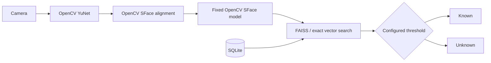

# Architecture

The system separates the fixed model from identity data:

Adding a person adds one normalized vector and metadata. Deleting a person removes or deactivates metadata and vector data. Neither operation retrains the embedding model.
